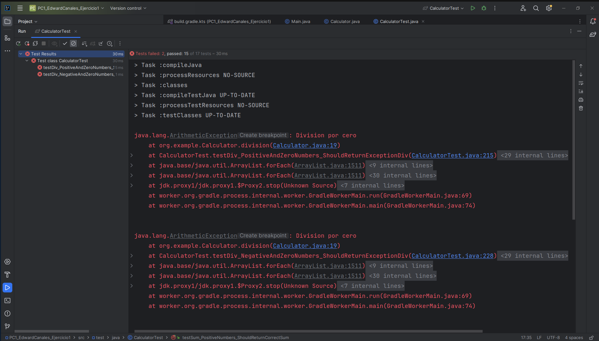

# Ejercicio 1
## Pruebas en ROJO
Primero escribimos las pruebas y ejecutamos, como aún no está definido la clase Calculator, entonces todas las pruebas fallarán (color ROJO)

## Pruebas en VERDE
Ahora escribimos código necesario para que pasen las pruebas (color verde)

